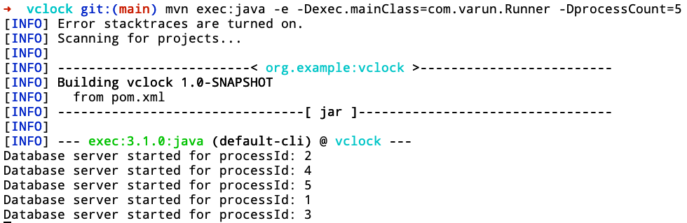
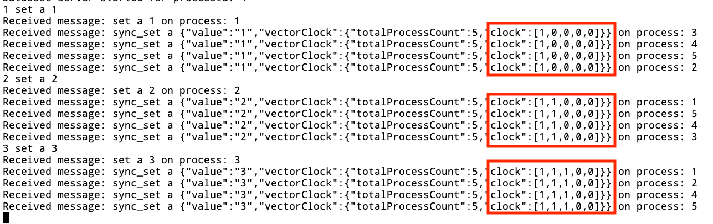
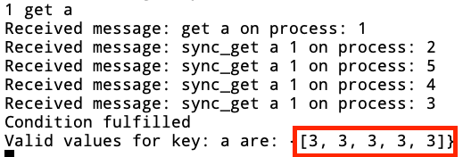

# Vector-Clock
An implementation of Vector Clock in Java. Covered in the blog post [Vector Clocks: So what time is it?](https://distributed-computing-musings.com/2023/04/vector-clocks-so-what-time-is-it/)

## Running the project
```agsl
mvn clean install
mvn exec:java -e -Dexec.mainClass=com.varun.Runner -DprocessCount=$processCount
```

## Demo
#### Starting the cluster(With 5 processes)


#### Processing SET request


#### Processing GET request
